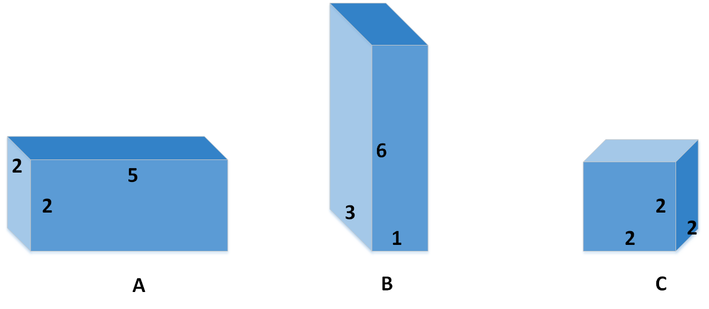
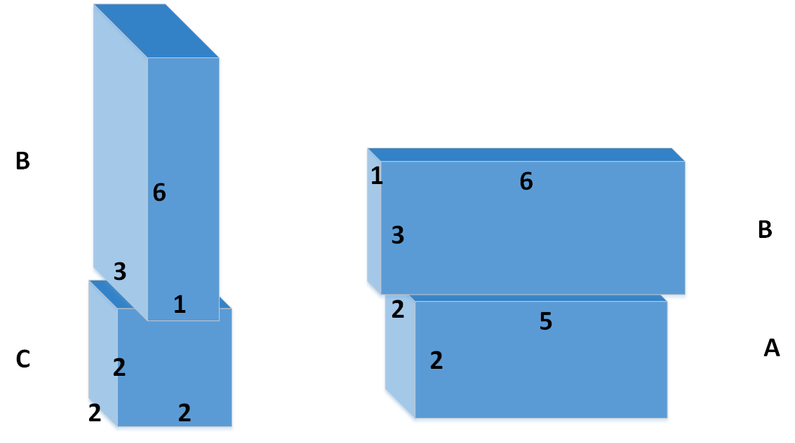

## Box Stacking Problem

#### Description

- Given N cubic boxes, stack them in order to acquire the maximal height.
- While stacking, an box should be perfectly stacked on the other. The term "perfect" will be explained in the following context.
- The width, length and height of these boxes are all integer numbers within [1, 10000].
- Boxes can be rotated.
- It is not necessary to use all the boxes.

For instance, given three boxes A, B, C,

the maximum height after stacking is 8. A possible stacking scheme is shown as follows.


**Perfect Stacking**

As you can tell from the above scheme, no part of the upper box can be seen from the bottom of the box beneath. We can call such stacking as "perfect stacking". Here are some scenarios that boxes are not perfectly stacked.



Note that it is not necessary to make use of all boxes to get the result height. For example, following scheme is also applicable.


#### I/O Formats

Input Sample:

```
4
2
43 23 45
54 65 24
3
75 39 69
39 59 57
43 45 98
5
52 5 63
6 26 45
3 43 6
45 65 2
45 7 3
12
56 76 2
65 45 6
43 65 87
52 54 8
43 65 8
26 45 87
43 64 7
34 65 8
233 45 6
43 65 67
4 56 87
243 65 7
```

**Description:**

- The number of the first row indicates the number of the total test case.
- Then follows each test case. In each case, the number of the first line indicates the number of the box. 
- Then follows the width, the length and the height of each box.
- In above case, we have 4 test cases; for the first test case, there are 2 boxes; for the first box of the first case, the width, the length and the height is 43, 23, 45, accordingly.

Output Sample:

```
#1 110
#2 179
#3 153
#4 845
```

**Description:**

The result of each test case, namely the maximum height of stacking, is printed after the `#test id` .

**Note:**

Above snippets are intend to illustrate the I/O format stipulation. The result shown in the "Output Sample" is not guaranteed correct.

#### Restrictions

- No libraries are allowed to be included by the program, except for `<iostream>` and `<fstream>`.
- Total running time of the program should be less than 5 seconds for 50 arbitrary cases.